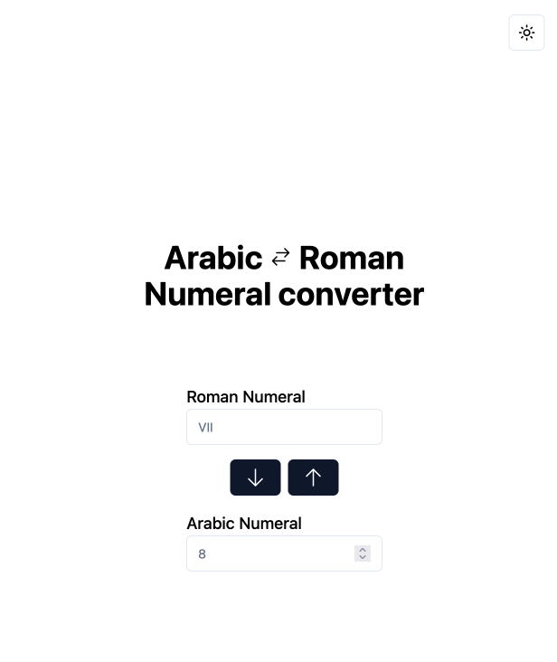

# Number Format Converter (Roman <=> Arabic)

### Features to be Added

    ✔︎ Copy to clipboard Button

    ✔︎ Convert numbers with keyboard event

    ✔︎ Clear all inputs button

    ✔︎ Add support for numbers greater than 3999

### Built with

- Reactjs
- Tailwindcss
- Shadcn/ui

### Disclaimer

1. This web app is for the European modified Roman numbers only.
2. This web app only works for numbers less than 4000.
3. It doesn't necessarily check for valid Roman number, it only checks for valid Roman characters.
